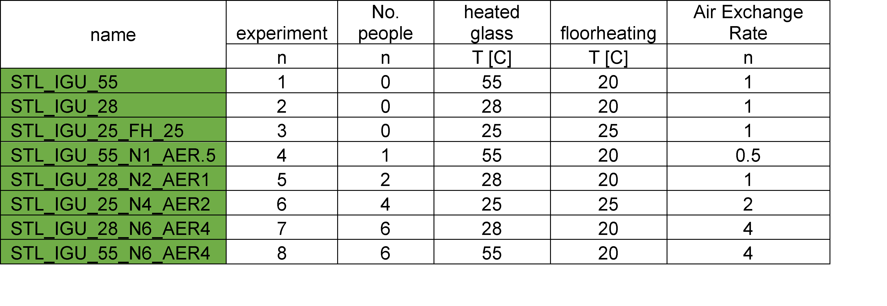

# Thermal simulations STL and Paraview

## Introduction

Computational Fluid Dynamic (CFD) simulations in general divide geometry
up into smaller blocks and calculate energy and mass balance at the
borders. Increasing the cell count, together with increasing the order
of applied calculation schemes increases accuracy. Both measures
increase the computational requirements too.

## Available simulation cases:

## Boundary conditions and simulation setup:

-   buoyantSimpleFoam/hotRadiationRoom example case has been used as a base.

-   k-epsilon turbulence model. Ideal gas, compressible.

-   externalWallHeatFluxTemperature heat transfer

    -   coefficient mode for wall temperature BC

    -   power mode for mannequin temperature BC,

-   simplefoam transient state

-   P1 radiation model

-   1e-4 residuals on: P_rgh, U, h, k, epsilon

-   1e-5 on G

-   dt = 1s.

See the title page for geometry indication, the same data can be
visualized in Paraview.

## Why Paraview

Because analyzing such vast 3D-datasets is common in multiple fields,
there is a good use for a program like Paraview
<https://www.paraview.org/> . This program allows you to analyze fields
(U, P, T, Q, G) or any arbitrary data-format with a suitable reader.

In this document I will walk you through my workflow for Paraview, this
comprises of the following:

1.  Starting up an analysis by opening a suitable file

    a.  I do this while the simulation is running, this allows me to refresh files and see the latest results as they are written

2.  Analyze the geometry

3.  Make suitable cuts in the 3D-geometry to visualize the results in 2D

4.  Analyze the different available fields and check for anomalies

5.  Create plots and export tabular data/screenshots

## Installation

Installation of ParaView is straightforward, go to the following site:
<https://www.paraview.org/download/> Download the Paraview-x.xx.x-MPI
executable version and install this.

# Tutorial

Some steps done below can be quickly done by loading the .pvsm files
with the **Load state** button, the files are slightly different.

The files for this tutorial should be downloaded (at least one case from
the table above)

## Opening paraview

After installation, open Paraview, and start with going to **File -\>
open (red)** and open the **STL_IGU.foam** (red) file (this activates
the openfoam reader built-in into Paraview)

You can see the numbered folders in green,
these represent simulation steps, if a transient solver was used, these
would be timesteps, in this case they show different states of flow and
temperature development. In general it is better to study the later
simulation steps for transient simulations.

On the left in the red box you see the pipeline browser, here you see
all operations represented as a tree structure. This allows you to setup
complex data processing pipelines parallel from eachother.

Below that you see the properties box, you'll spend a lot of time here
setting up visualizations. Here it shows what mesh regions to show,
starting with internalMesh is the best Idea, so press **apply** to start
loading the simulation.

At first this doesn't tell a lot, and immediately brings the problem of
3D simulations to light, data for each point in space.

In the green box above you see the field indicator, here you can select
the speed field (**u**), pressure (**p**), radiation (**G**, W/m2)**,**
temperature (**T**) and more. You could calculate new fields with
postprocessing steps in ParaView (for example thermal comfort, PMV,
etc). Select the Temperature field **T** for now.

In the yellow box you see the time indicator, you can go to the latest
timestep available for now.

Now select **STL_IGU.foam (blue)** in the **pipeline browser** and press
**\<ctrl+space>**, a pop-up **search-window** opens to tie new functions
to your current selection. Now type **slice** and click the symbol
(blue) and press apply in the **properties**. Now you get some insight
into the simulation.

Now
Make a similar cut for the Y-plane by opening the **search-window** and
creating a new slice (select STL_IGU.foam first).

In the properties browser you get access to more settings by pressing the cogwheel, and
you can quickly select the Y-plane as normal for cutting.

Now select **Slice1** and open the **search-window**, look for
**Contour** and go to properties.

Now select **contour by: T** and clear the **value range** with the
cross. Now make a new **range** with the range button from for example
290 -- 305 in 25 steps.

Select the file again and look for the
**clip** function. In properties select **clip type** **scalar** and
select **Scalars** **T.** Now untick the **invert** tickbox, and you can
visualize all temperatures above the temperature set with the **value**
slider.

Now you can set a better color scheme to for example determine zoning by
playing with the scale, see below screenshots.

Another valuable
function for characterization is the **plot over line** and **plot over
time** function. Here I'll show the first. Select the file and search
for **plot over line** and **apply** in **properties.**

A plot shows, and as shown above 6 coordinates for 2 points can be set,
the start and end-point of your line. Values can be retrieved along this
line. If you scroll down, you can filter out fields to plot.

Another important trick is the extensive export functions paraview
offers, select anything and press the screenshot buttons in the windows
with **CTRL/SHIFT** modifier keys and you can save screenshots or
tabular data immediately, or through the file menu after selection.

Next to that you can split windows and open for example the
**spreadsheet view**, this allows you to view any compatible data as a
table and export it as such. If you can't export it conveniently yet,
see if you can transform it with Paraview, it's fast and efficient and
easy to work with after you get used to it.

## Final exercise -- compare different simulations

The next goal will be to load multiple
simulations in ParaView and compare them in the same view.

Start with adding a Z-normal slice to the original file, hide all other
slices and operations by clicking the eyeball symbol, and center to the
X-Y-plane with the button in the toolbar. Also close the other views and
resize the color-legend.

Now rename the slice to represent your simulation, and open an
additional **\*.foam** file in the pipeline browser (through **file**
menu).

In the **properties** you can see which simulation folder is loaded,
make sure they are different.

First we need to slice the newly loaded file the same. Select the new
**STL_IGU.foam** and make a **Z-normal slice.** Now we need to translate
the slice up or left to not block the current visualization. In the
properties browser select the latest slice, look for **tran** and enter
a **-3.5** **y** translation. This will place it just below the previous
cut.

These steps can be repeated for all
simulations and different slice directions, comparisons between
different situations can be made. By playing with the scale and
representation valuable insights can be made. This shows a scale from
290 to 301 K, which indicates the difference between a 28C pane and 55C
pane well at this specific slice location.

## Load state

Load state is a handy feature to load a pre-set arrangement of windows
and analysis, it also restores any tabs you created. Press **file** -\>
**load state** and find a **STL_Tut.pvsm** or
**STL_ThermalAnalysis.pvsm** file and press ok.  Then select **search under specified
folder** in the pop-up and redirect to the **\*.foam** file of the case
you want to load.

